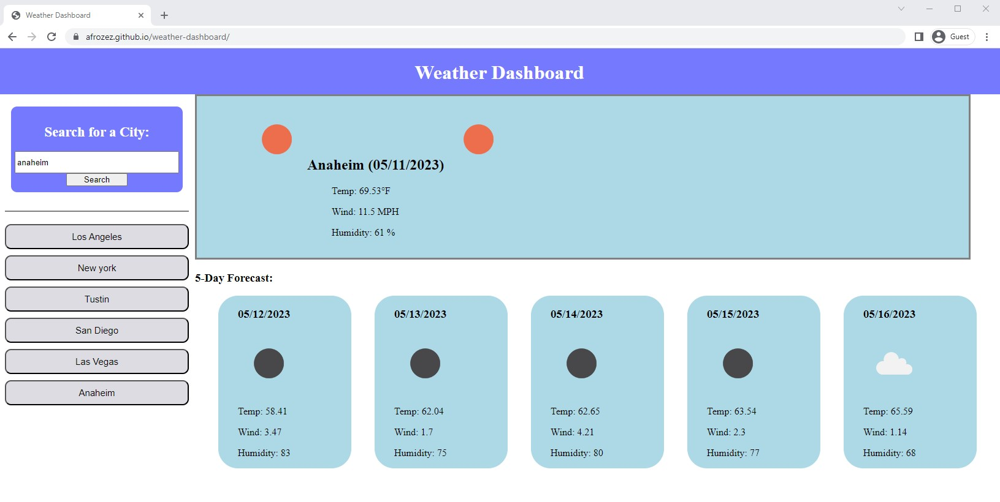

# weather-dashboard

Link to deployed application: https://afrozez.github.io/weather-dashboard/

## This project tested all of my previous knowledge using Server-Side APIs and JavaScript.

I searched the documentation for multiple different API calls to add the current weather data along with the following 5 day forecast data.
I got some much-needed practice using APIs and have a much better grasp on how to set/get data from local storage. This is NOT considered a complete project and is currently a work in progress.

 If anyone would like to work on/add to this project it is recommended to first follow these steps:
- Download Visual Studio Code: https://code.visualstudio.com/
- Pull the files from my GitHub Profile Repository: https://github.com/Afrozez/weather-dashboard
- It is recommended to have the latest version of Google Chrome downloaded which can be found here: https://www.google.com/chrome/.
- Read the information provided to you on the openweather API documentation: https://openweathermap.org/

## Usage
This project (https://afrozez.github.io/workdayscheduler/) displays a web-based program. This web application displays relevant information such as wind speed, humidity, and temperature. Upon entering a specific city, the user will be shown the five-day forecast as well. Once you submit a valid city to search for it will also create a new button icon with the value of the city name you enter. This will allow users to quickly go back to a city that was entered previously. If any users have any questions about how to use this webpage they can reach me at lukeadenhartog@gmail.com.

## Credits
 This project was created by Luke A DenHartog. Phillip Loy was a big help though. He taught me numerous things like how to make the search bar have more functionality. Phillip also showed me how to apply the append child method alongside the create element method in order to create a dynamic 5-day forecast list.  Also I'd like to credit Jared K. for reintroducing a previously talked about css attribute (flex-grow) in order to create a clean presentable web application. Doing this really tested everything i've been learning. Learning from experienced developers is not only challenging but also inspiring. I'd hope that I can one day be as fluid and fast as some of these developers with decades of experience.

## License

## Copyright (c) 2023 Luke

Permissions are hereby granted, free of charge, to any person obtaining a copy of this software and associated documentation files (the "Software"), to deal in the Software without restriction, including without limitation the rights to use, copy, modify, merge, publish, distribute, sublicense, and/or sell copies of the Software, and to permit persons to whom the Software is furnished to do so, subject to the following conditions:

The above copyright notice and this permission notice shall be included in all copies or substantial portions of the Software.

THE SOFTWARE IS PROVIDED "AS IS", WITHOUT WARRANTY OF ANY KIND, EXPRESS OR IMPLIED, INCLUDING BUT NOT LIMITED TO THE WARRANTIES OF MERCHANTABILITY, FITNESS FOR A PARTICULAR PURPOSE AND NONINFRINGEMENT. IN NO EVENT SHALL THE AUTHORS OR COPYRIGHT HOLDERS BE LIABLE FOR ANY CLAIM, DAMAGES OR OTHER LIABILITY, WHETHER IN AN ACTION OF CONTRACT, TORT OR OTHERWISE, ARISING FROM, OUT OF OR IN CONNECTION WITH THE SOFTWARE OR THE USE OR OTHER DEALINGS IN THE SOFTWARE.